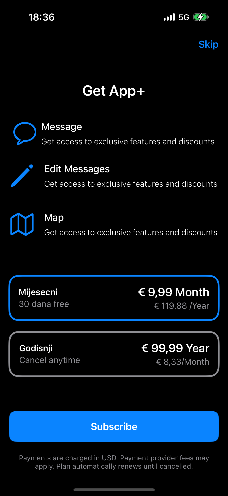

# PaymentView
PaymentView SwiftUI

  

Dobrodošli u moj projekt! Ovdje možete pronaći detalje o funkcionalnostima i kako ga koristiti.

## Opis

Ovaj projekt je zamišljen kao aplikacija za placanje i koristenje s Apple StoreKit?

## Kako koristiti

1. Preuzmite projekt s GitHub-a.
2. Uredite prema zalji. 
3. Pokrenite aplikaciju.

Ovdje možete opisati što slika prikazuje.

## Licence

Ovaj projekt koristi <a href="https://github.com/Mihael-Koic">Mihael Koic</a>.
